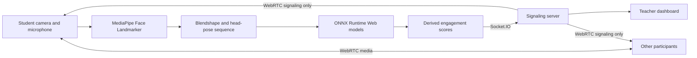

# Class Meet

Class Meet is a real-time video classroom that gives teachers a live view of student engagement. Participants join a room through the browser and exchange camera and microphone streams over WebRTC. On each student device, MediaPipe converts the local camera feed into facial blendshape and head-pose features, and ONNX models turn a short rolling sequence of those features into engagement, boredom, and comprehension signals. Only the derived scores are sent through the application server to the teacher; the camera and microphone streams remain peer-to-peer.

The first person to enter a new room becomes the teacher. Everyone who joins the same room afterward is treated as a student. Teachers see the regular meeting grid plus an attention-oriented roster and dashboard with current statuses, class-level summaries, individual trend charts, sustained-state flags, camera state, and signal freshness.

## Features

- Browser-based meeting creation and room-code joining
- Full-mesh WebRTC video and audio for small-group classes
- Microphone and camera controls with camera-off avatars
- Automatic teacher and student roles based on join order
- Local, in-browser engagement inference for student video
- Engagement, boredom, and comprehension-problem signals
- Engaged, neutral, and bored status classification
- Teacher-only student status indicators and attention sorting
- Sustained boredom and confusion flags with toast notifications
- Class summary statistics and per-student session history
- SVG trend charts for engagement, boredom, and confusion
- Camera-off and missing-score-signal indicators
- Python pipeline for DAiSEE preprocessing, training, evaluation, and ONNX export

## How it works



### 1. Room creation and roles

The landing page creates a six-character room code or accepts an existing code. The Socket.IO server keeps an in-memory room registry. The first socket in a room is assigned the `teacher` role, and later participants are assigned the `student` role. Join and leave events keep every client's participant list synchronized.

### 2. Peer-to-peer media

Each browser requests camera and microphone access with `getUserMedia`. Participants establish a full-mesh set of `RTCPeerConnection` instances, using Socket.IO to relay WebRTC offers, answers, and ICE candidates. A public Google STUN server assists connection discovery. Once negotiated, audio and video travel directly between peers.

### 3. Local feature extraction

Student browsers run MediaPipe Face Landmarker against their own local video at approximately 2 Hz. Each sample contains:

- 52 facial blendshape values
- 6 head-pose values taken from the first two columns of the facial rotation matrix
- 58 frame-to-frame delta values that describe how the features are changing

This produces a 116-value vector per sampled frame. The browser keeps a rolling window of up to 20 frames, representing roughly ten seconds of activity, and begins scoring after five valid frames.

### 4. ONNX inference

ONNX Runtime Web loads the models from `client/public/models/`. The engagement model supplies disengagement, low-engagement, and boredom outputs, while the comprehension model supplies the combined confusion/frustration output. The browser calibrates these values for display and converts the disengagement output into an `engaged`, `neutral`, or `bored` status.

The training and browser pipelines share the same feature layout, frame sampling rate, head-pose representation, delta expansion, and dynamic sequence format.

### 5. Teacher insights

Student clients emit derived scores through Socket.IO. The server routes those scores only to the room's teacher. The teacher client maintains a bounded history for each student and prioritizes the roster by attention level.

A student is flagged after a sustained state:

- Confusion signal: 60 seconds
- Bored status: 90 seconds
- Missing score signal while the camera is on: 8 seconds

The class dashboard shows average engagement, current flags, camera-off counts, status-aware sorting, compact roster trends, full individual charts, and the flag history for the current session.

## Technology stack

| Area | Technology |
| --- | --- |
| Client | React, TypeScript, React Router |
| Styling | Tailwind CSS |
| Build tooling | Vite |
| Real-time events | Socket.IO |
| Media | WebRTC and browser Media Capture APIs |
| Face features | MediaPipe Face Landmarker |
| Browser inference | ONNX Runtime Web |
| Server | Node.js, Express, TypeScript |
| ML pipeline | Python, PyTorch, NumPy, pandas, scikit-learn |
| Video preprocessing | OpenCV and MediaPipe |
| Experiment tracking | Weights & Biases |

## Project structure

```text
facecam-engagement/
├── client/
│   ├── public/models/       # ONNX models served with the client
│   ├── src/components/      # Meeting controls, video tiles, and dashboard UI
│   ├── src/lib/             # WebRTC, browser inference, and student tracking
│   ├── src/pages/           # Landing and meeting routes
│   ├── src/types.ts         # Typed Socket.IO event contract
│   └── vite.config.ts       # React build and development proxy
├── server/
│   ├── src/server.ts        # Express server, rooms, and Socket.IO relay
│   └── src/types.ts         # Server-side event contract
├── ml/
│   ├── preprocess.py        # Extracts MediaPipe features from DAiSEE clips
│   ├── train.py             # Trains the multi-task GRU model
│   ├── evaluate.py          # Evaluates deployed ONNX artifacts
│   ├── export_onnx.py       # Exports PyTorch checkpoints for the browser
│   ├── model.py             # GRU, attention layer, and task heads
│   ├── labels.py            # Shared DAiSEE target definitions
│   └── features.py          # Shared frame-delta feature transformation
├── package.json             # Root development and production commands
└── README.md
```

## Getting started

### Prerequisites

- Node.js 22 or a current Node.js release compatible with Vite 8
- npm
- A modern browser with WebRTC, WebAssembly, and camera/microphone support

Camera and microphone access works on `localhost` during development and on secure HTTPS origins when deployed.

### Install dependencies

From the repository root:

```bash
npm install
npm run install:all
```

The first command installs the root development runner. The second installs the client and server dependencies.

### Run in development

```bash
npm run dev
```

This starts both workspaces:

- Vite client: `http://localhost:5173`
- Express and Socket.IO server: `http://localhost:3000`

During development, Vite proxies `/socket.io` traffic to the server.

### Start a meeting

1. Open `http://localhost:5173` in the teacher's browser.
2. Enter a display name and select **Create meeting**.
3. Share the room code shown in the meeting header.
4. Students enter their names and the room code on the landing page, then select **Join**.
5. Allow camera and microphone access when prompted.
6. Use the dashboard button in the teacher's control bar to open class insights.

To test locally with multiple participants, open the meeting in separate browser windows or profiles and join with the same room code.

## Production build and server

Build the React client:

```bash
npm run build
```

The output is written to `client/dist/`.

Build the client and start the Express server together:

```bash
npm start
```

The server hosts the compiled client, provides the React Router fallback for meeting URLs, and serves Socket.IO from the same origin at `http://localhost:3000`.

Set a different server port with the `PORT` environment variable:

```bash
PORT=8080 npm start
```

## Available npm commands

Run these from the repository root unless noted otherwise.

| Command | Purpose |
| --- | --- |
| `npm run install:all` | Installs dependencies in `client/` and `server/` |
| `npm run dev` | Runs the Vite client and TypeScript server together |
| `npm run build` | Type-checks and builds the client |
| `npm start` | Builds the client and starts the production server |
| `npm run preview --prefix client` | Previews an existing Vite production build |
| `npm run dev --prefix server` | Runs the server directly in watch mode |

## Socket.IO event flow

The client and server maintain matching typed event contracts in `client/src/types.ts` and `server/src/types.ts`.

| Event | Direction | Purpose |
| --- | --- | --- |
| `join-room` | Client → server | Joins a room with a display name |
| `joined` | Server → joining client | Returns the assigned role and existing peers |
| `peer-joined` | Server → room | Announces a new participant |
| `peer-left` | Server → room | Removes a disconnected participant |
| `signal` | Both directions | Relays WebRTC SDP and ICE data |
| `engagement-score` | Student → server | Sends locally derived engagement values |
| `engagement-update` | Server → teacher | Delivers a student's values to the teacher |
| `camera-state` | Client → server | Announces a local camera toggle |
| `camera-state-update` | Server → room | Synchronizes a participant's camera state |

## Engagement model

### Input representation

The model receives a variable-length sequence with shape:

```text
(batch, sequence length, 116 features)
```

The 116 inputs are the 58 raw MediaPipe features followed by their 58 frame-to-frame deltas. The deployed graph uses a fixed batch size of one and a dynamic sequence-length axis.

### Architecture

`EngagementModel` uses:

1. A GRU with a 64-value hidden representation
2. A learned attention layer over sequence steps
3. Dropout on the aggregated sequence context
4. Independent sigmoid heads for each task

The model produces four outputs:

- `disengaged` — primary binary training and status signal
- `low_engagement` — continuous low-engagement signal
- `high_boredom` — continuous boredom signal
- `comprehension_problem` — combined confusion/frustration signal

### Label construction

The ML pipeline derives targets from DAiSEE's 0–3 annotations. Disengagement combines low engagement and high boredom. The auxiliary heads preserve normalized ordinal scores, and the comprehension target uses the stronger of confusion and frustration.

Training pools the DAiSEE Train and Validation features, then creates a seeded subject-level validation split. This keeps each subject entirely within one side of the split. A weighted sampler balances the primary task, while task-specific weights preserve the contribution of auxiliary positive examples. The best checkpoint is selected by validation balanced accuracy.

## ML workflow

The deployed ONNX files are already included under `client/public/models/`. The commands below reproduce the preprocessing, training, export, and evaluation workflow.

Run ML commands from the `ml/` directory:

```bash
cd ml
```

### 1. Create a Python environment

```bash
python3 -m venv venv
source venv/bin/activate
pip install -r requirements.txt
```

### 2. Prepare DAiSEE

Extract DAiSEE into the following layout:

```text
ml/data/raw/DAiSEE/
├── Labels/
│   ├── TrainLabels.csv
│   ├── ValidationLabels.csv
│   └── TestLabels.csv
└── DataSet/
    ├── Train/
    ├── Validation/
    └── Test/
```

Download the MediaPipe Face Landmarker model used during preprocessing:

```bash
curl -L -o face_landmarker.task \
  https://storage.googleapis.com/mediapipe-models/face_landmarker/face_landmarker/float16/latest/face_landmarker.task
```

### 3. Extract features

```bash
python preprocess.py --data-root data/raw/DAiSEE
```

This processes the Train, Validation, and Test splits and writes cached arrays to `data/features/`. For a shorter preprocessing run, pass `--max-clips` with a per-split clip count.

### 4. Train a model

```bash
python train.py \
  --features-dir data/features \
  --data-root data/raw/DAiSEE \
  --out checkpoints/model.pt
```

Training logs experiments to Weights & Biases by default. Use `--no-wandb` for a local run without experiment tracking. Other configurable options include epochs, batch size, learning rate, weight decay, dropout, auxiliary-loss weight, and validation fraction; run `python train.py --help` for the complete list.

### 5. Export a checkpoint to ONNX

```bash
python export_onnx.py \
  --checkpoint checkpoints/model.pt \
  --out ../client/public/models/engagement.onnx
```

The exported model exposes named task outputs and accepts dynamic sequence lengths. A task-specific checkpoint can be exported to `../client/public/models/confused.onnx` in the same way.

### 6. Evaluate deployed models

```bash
python evaluate.py
```

Evaluation runs the actual ONNX artifacts in `client/public/models/` against the cached DAiSEE Test split. It reports positive-class prevalence, ROC AUC, precision-recall AUC, F1, balanced accuracy, Brier score, optimized F1 thresholds, and CPU inference latency and throughput.

## Validation

Type-check and build the client from the repository root:

```bash
npm run build
```

Type-check the server:

```bash
cd server
npx tsc --noEmit
```

Check the Python pipeline for syntax errors from the repository root:

```bash
python3 -m py_compile ml/*.py
```

## Runtime data flow and privacy

- Camera and microphone tracks are carried over peer-to-peer WebRTC connections.
- Facial feature extraction and ONNX inference run in the student's browser.
- The application server relays WebRTC negotiation messages, participant metadata, camera state, and derived engagement scores.
- The teacher dashboard keeps score history in client memory for the active meeting session.
- Room membership is maintained in server memory for the active server process.

## Key configuration values

The main inference and tracking settings are colocated with their implementations:

| Setting | Value | Location |
| --- | --- | --- |
| Feature sampling | 2 Hz | `ml/preprocess.py`, `client/src/lib/engagementScorer.ts` |
| Rolling inference window | 20 frames | `client/src/lib/engagementScorer.ts` |
| Minimum frames before scoring | 5 frames | `client/src/lib/engagementScorer.ts` |
| Neutral status band | ±0.12 around 0.5 | `client/src/lib/engagementScorer.ts` |
| Confusion flag duration | 60 seconds | `client/src/lib/studentTracking.ts` |
| Boredom flag duration | 90 seconds | `client/src/lib/studentTracking.ts` |
| Missing-signal duration | 8 seconds | `client/src/lib/studentTracking.ts` |
| Per-student history | Up to 1,200 points | `client/src/lib/studentTracking.ts` |
| Default server port | 3000 | `server/src/server.ts` |

